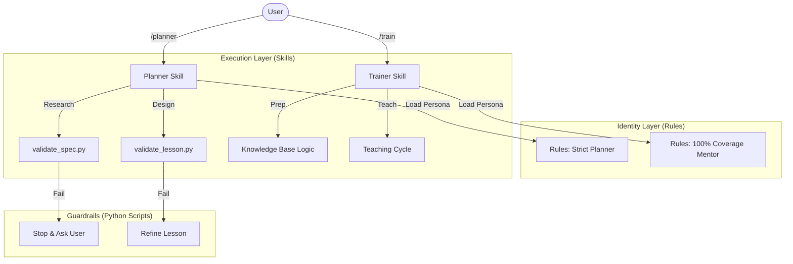

# 🧠 Agentic Odoo Learning System

> **A self-improving, rigorous AI mentorship program for mastering Odoo Framework.**
> Built on a **Hybrid Architecture** of Rules (Identity), Skills (Execution), and Scripts (Guardrails).


## 📖 Overview

This repository is not just a collection of Odoo code. It is the workspace for an advanced **AI Agent System** designed to teach Odoo development with Senior-level strictness.

It replaces traditional "Chatbot Tutorials" with a structured, rigorous workflow:
1.  **Planner Agent**: Researchs specs, validates code, and designs high-fidelity lesson plans (0% hallucinations allowed).
2.  **Trainer Agent**: Teaches strict source-code reading, context-first concepts, and enforces "100% Coverage".

## 🏗 System Architecture

The system operates on three layers:



### Key Components

| Component | Responsibility | Magic Sauce 🌶️ |
| :--- | :--- | :--- |
| **Rules** (`.agent/rules`) | **Identity** | Defines the "Personality" (e.g., "I hate toy examples"). Injected on-demand. |
| **Skills** (`.agent/skills`) | **Execution** | Defines the "How-To". Contains strict procedures (Steps 1, 2, 3). |
| **Scripts** (`.agent/dist`) | **Guardrails** | Python scripts that *mathematically* prove if the AI is doing its job (e.g., counting lesson concepts). |

## 🚀 Usage

### 1. The Planner (`/planner`)
Generates production-ready lesson plans.

-   **Command**: `/planner create day [X]`
-   **Workflow**:
    1.  **Deviations Check**: Scans your code. If you added features not in the Spec, it STOPS and asks to Keep or Trash.
    2.  **Research**: Reads `module_spec.md` and queries official docs (Context7).
    3.  **Validation**: A Python script counts concepts/exercises. If too generic, it rejects the plan.

### 2. The Trainer (`/train`)
Your personal Senior Mentor.

-   **Command**: `/train day [X]`
-   **Workflow**:
    1.  **Knowledge Lookup**: Checks local `references/` cache. If missing, queries Context7 and **saves new knowledge** for future use.
    2.  **Source Code First**: Forces you to read `odoo/` source code line-by-line before teaching concepts.
    3.  **100% Coverage**: Will not let you skip topics.

## 📂 Repository Structure

```
.
├── .agent/                 # The Brain 🧠
│   ├── rules/              # Agent Personas (Identity)
│   ├── skills/             # Agent Capabilities (Procedures + Scripts)
│   ├── learning/           # Curriculum & Knowledge Base
│   │   ├── daily_notes/    # Generated Lesson Plans
│   │   ├── references/     # Cached Knowledge (Wiki)
│   │   ├── module_spec.md  # The "Target" State
│   │   └── actual_module.md# The "Current" State
│   └── workflows/          # (Archived legacy workflows)
├── custom_addons/          # The Odoo Code being built
└── README.md               # You are here
```

## 🛡️ "Zero Hallucination" Mechanisms

How we prevent the AI from lying:
1.  **`validate_spec.py`**: Compares the English specification vs. Actual Python Code. Mismatches trigger a HALT.
2.  **`validate_lesson.py`**: A regex-based script that grades the AI's lesson plan. If it's "lazy", the script fails pipeline.
3.  **`prep_checklist.md`**: Forces the Trainer to call `view_file` on source code before speaking.

## 🤝 Contribution

This is a personal learning workspace, but the **Agent Architecture** is reusable.
Feel free to copy `.agent/` folder to your own projects to enable this AI workflow.

---
*Powered by Agentic AI Engineering*
