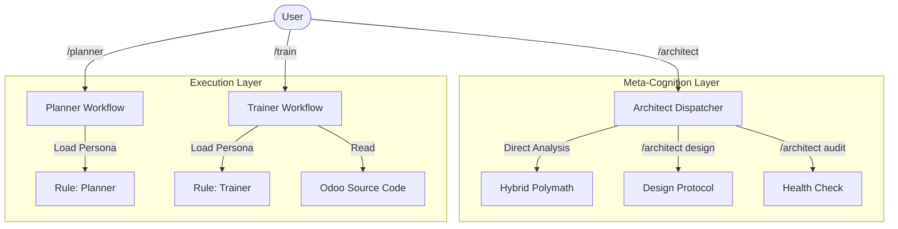

# 🧠 Agentic Odoo Learning System

> **A self-improving, rigorous AI mentorship program for mastering Odoo Framework.**
> Built on a **Hybrid Monolith Architecture** of Rules (Identity) and Workflows (Process).


## 📖 Overview

This repository is not just a collection of Odoo code. It is the workspace for an advanced **AI Agent System** designed to teach Odoo development with Senior-level strictness.

It replaces traditional "Chatbot Tutorials" with a structured, rigorous workflow:
1.  **Architect Agent**: Designs, audits, and maintains the system integrity (`/architect`).
2.  **Planner Agent**: Researchs specs, validates code, and designs high-fidelity lesson plans (`/planner`).
3.  **Trainer Agent**: Teaches strict source-code reading, context-first concepts, and enforces "100% Coverage" (`/train`).

## 🏗 System Architecture

The system operates on a **Hybrid Monolith** model:



## 🚀 Usage

### 1. The Architect (`/architect`)
*The System Engineer.*
- **Commands**: 
    - `/architect analyze [question]` (Direct Q&A)
    - `/architect audit` (System Health Check)
    - `/architect design` (Create New Agent)

### 2. The Planner (`/planner`)
*The Strategist.*
- **Command**: `/planner create day [X]`
- **Goal**: Generates production-ready lesson plans.

### 3. The Trainer (`/train`)
*The Mentor.*
- **Command**: `/train day [X]`
- **Goal**: Teaches strict source-code reading and enforces 100% coverage.

## 📂 Repository Structure

```
.
├── .agent/                 # The Brain 🧠
│   ├── rules/              # Agent Personas (Identity)
│   ├── workflows/          # Process Definitions (The Work)
│   │   ├── sub/            # Specialized Protocols (Audit, Design)
│   │   └── _archive/       # Legacy Protection
│   └── learning/           # Curriculum & Knowledge Base
├── custom_addons/          # The Odoo Code being built
└── README.md               # You are here
```

## 🛡️ "Zero Hallucination" Mechanisms

How we prevent the AI from lying:
1.  **Strict Identity**: Agents must read their Rule file before acting (Single Source of Truth).
2.  **Protocol Enforcement**: Steps are hardcoded in Workflows.
3.  **Context7 Integration**: Mandatory external verification for best practices.

## 🤝 Contribution

This is a personal learning workspace, but the **Agent Architecture** is reusable.
Feel free to copy `.agent/` folder to your own projects to enable this AI workflow.

---
*Created by NHPDev with Agentic AI Engineering*
